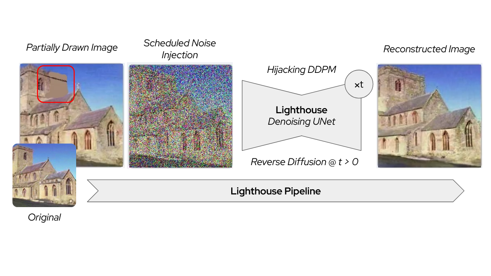
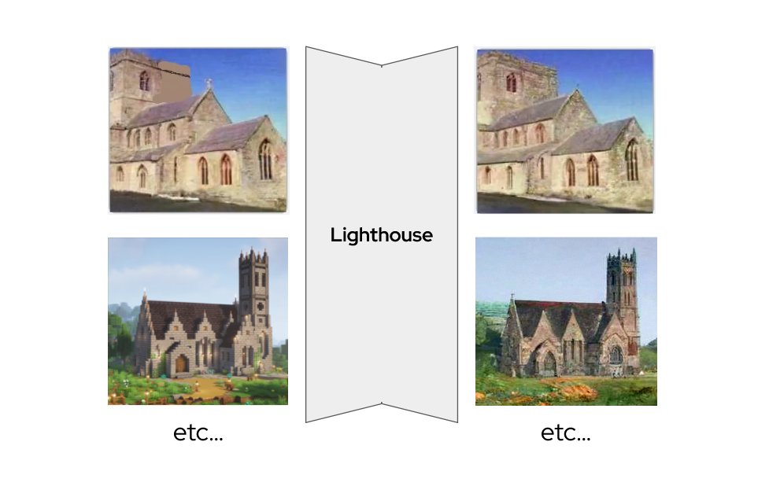

# Creative Image Generation with Lighthouse




# Getting Started with Lighthouse

## Requirements

- **Python 3**  
  You'll also need some Python libraries. The easiest way to get them is to try running `gui.py` — just `pip install` whatever errors pop up.

- **CUDA-enabled GPU**  
  Unfortunately, CPU support isn't really viable for heavier diffuser models — a CUDA-compatible GPU is a must.

- **Torch with CUDA support**  
  Make sure your PyTorch installation is CUDA-enabled. If it isn't, you'll likely need to uninstall and reinstall the appropriate version manually.

---

## Running the GUI

To launch the GUI (like you see in the demo), simply run:

```bash
python3 gui.py
```

## Using the Model API

If you'd rather use the model programmatically, you can start with `church.py` (currently the only API script uploaded). To swap in a different model — for example, another one of Google's DDPM models — just modify the relevant section in `church.py`. It's a relatively straightforward change, and the code is written to be easy to follow.

> ℹ️ Documentation for church.py is now in documentation/church.html. Due to financial reasons, I cannot host the documentation on a website, so simply load the path of the html file into your browser. If you'd like a more rustic demo of the API itself (the gui demo is a bit heavy), check out api_demo.py

---

## Model Downloads

Whether you're running `gui.py` or using `church.py`, the model needs to be available locally. If it isn’t already on your machine, it will be downloaded automatically.

⚠️ **Make sure you have at least 2GB of free disk space** to accommodate the model download (Other frameworks and pipelines might also be downloaded, so just make sure you have enough space).

# What is Lighthouse?

## Inspiration 🌅

We’ve all been there: you snap a bunch of photos to capture a moment, only to look back and feel like something’s missing. Maybe the lighting was off, the image is way too grainy, or there’s a distracting detail you wish you could erase. The photo just doesn’t feel like the moment you lived. That frustration is what inspired Lighthouse — a tool designed to reconstruct and creatively reimagine noisy or imperfect images using the power of diffusion.

## What it does ⚙️

Lighthouse is powered by diffusion models — deep learning systems that can generate detailed, high-quality images from nothing but noise. Normally, these models start from pure randomness and gradually subtract noise in small steps, revealing an image as they go. I thought: what if we hijack this process? What if we insert a real image midway through the diffusion process and let the model rebuild it with enhanced detail or creative variation?

Lighthouse focuses on two main tasks:

1. Extreme Image Denoising: In low light or high ISO situations, your image can be so noisy it’s nearly unusable. Lighthouse uses a diffusion model’s inherent denoising ability to recover and recreate details that likely existed — even when traditional filters fail.

2. Creative Generation: By modifying and adding noise back into an image (a process I call renoising) and running it through the diffusion model again, Lighthouse can generate realistic and artistic variations based on small modifications — enabling expressive, intuitive editing.

Check out the demo to see both of these modes in action!

## How I built it 🛠

Lighthouse is built using Google’s Denoising Diffusion Probabilistic Models (DDPM). This architecture lets me skip the initial timesteps and start the denoising process from a partially noisy, real image. To make renoising work, I also implemented a custom noise scheduler that simulates the same noise induction process used during training.

## Challenges I ran into 🚧

Diffusion models are powerful — and incredibly compute-heavy. Even with a decent GPU (RTX 2070), running high-res models pushed the limits. After experimenting with several architectures, I landed on a model that struck the right balance between performance and output quality. Training a model from scratch would’ve taken more than a hundred years on my setup (literally) — so for now, pre-trained models are the move.

## Accomplishments that I'm proud of ✅

The best part? Lighthouse works. It can bring detail back into unrecognizable images and enable amazing, creative edits in just a few steps.

## What we learned 📚

This project was my first time working hands-on with diffusion models, and it was a deep dive. I already had a theoretical understanding, but implementing denoising, scheduling, and custom workflows really pushed my understanding to the next level — especially when experimenting with novel use cases like renoising.

## What's next for Lighthouse 🔮

I’m excited to take Lighthouse even further with:

- Stable Diffusion Integration: Operating in the latent space using VAEs, which could unlock faster and higher-resolution generation.
- LoRA Fine-Tuning: Adding lightweight adapter training to guide generation using semantic concepts, all without retraining the entire model.
